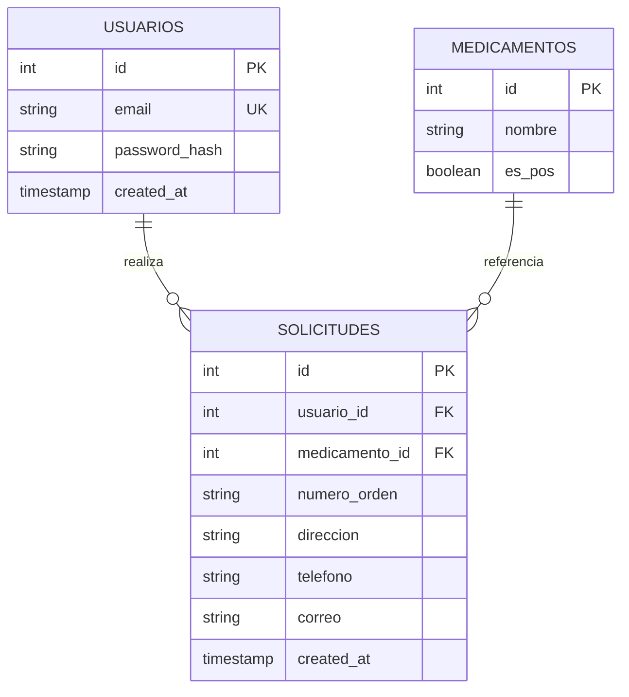

# 🏥 EPS — Prueba técnica · Angular + Flask + PostgreSQL

Aplicación full stack para gestión de **solicitudes de medicamentos**: autenticación con JWT, catálogo POS / NO POS, creación de solicitudes con validación condicional y listado paginado.

El repositorio tiene dos proyectos independientes:

| Carpeta | Rol |
|---------|-----|
| `eps-solicitudes-api/` | API REST en Flask (blueprints `auth` y `solicitudes`) |
| `eps-solicitudes-web/` | SPA Angular — login, registro, formulario, listado |

La base de datos es PostgreSQL, dockerizada junto a la API mediante `docker-compose`.

---

## 🔗 Repositorio

**GitHub:** [https://github.com/lordmkichavi-andes/nueva-eps-pt](https://github.com/lordmkichavi-andes/nueva-eps-pt)

Rama principal: `main`. Cada `push` dispara **CI** (pytest + build Angular): [`.github/workflows/ci.yml`](.github/workflows/ci.yml).

---

## ✅ Qué incluye esta entrega

- [x] **Backend** Python/Flask: `/auth/login`, `/auth/register`, contraseñas con bcrypt, JWT en rutas protegidas.
- [x] **Blueprints separados** para autenticación y solicitudes.
- [x] **Frontend** Angular: login/registro, campos extra para medicamentos NO POS, listado paginado solo para usuarios autenticados.
- [x] **PostgreSQL**: script `schema.sql` + modelo ER en este README.
- [x] **Documentación**: endpoints, variables de entorno, Docker Compose para levantar API + BD.
- [x] **Pruebas**: pytest en la API, tests básicos en Angular; CI configurado en GitHub.

---

## ⚡ Validación rápida (~5 min)

### Paso 0 — Requisitos previos

- **Docker Desktop** (o Engine + Compose).
- **Node.js 20+** y **npm** (solo para el front).

### Paso 1 — Levantar API y BD

Desde la **raíz del repositorio**:

```bash
docker compose up -d --build
```

Verifica que la API responde:

```bash
curl -s http://localhost:5000/health
# → {"status":"ok"}
```

> Si el puerto 5432 ya está ocupado en tu máquina, no pasa nada: el compose publica PostgreSQL en el **5433** del host y la API sigue conectándose al servicio `db` por red interna.

### Paso 2 — Levantar el front

En **otra terminal**:

```bash
cd eps-solicitudes-web
npm install
npm start
```

Cuando veas `http://127.0.0.1:4200` (o `localhost:4200`) en la consola, el front está listo.

### Paso 3 — Prueba en el navegador

1. Abre **http://localhost:4200**
2. **Regístrate** con correo válido y contraseña de al menos 8 caracteres.
3. En **Nueva solicitud**, elige un medicamento **POS** y envíala; debe aparecer en Mis solicitudes.
4. Elige uno **NO POS**: se muestran y validan orden médica, dirección, teléfono y correo.
5. Verifica la **paginación** agregando varias solicitudes.

### Paso 4 — Pruebas automáticas (opcional)

```bash
# API — siempre dentro del venv
cd eps-solicitudes-api
python3 -m venv .venv && source .venv/bin/activate
python -m pip install -r requirements-dev.txt
python -m pytest -v
```

```bash
# Front
cd eps-solicitudes-web
npx ng test --no-watch --browsers=ChromeHeadless
npm run build
```

---

## 🌐 URLs y puertos

| Servicio | URL / Puerto | Notas |
|----------|--------------|-------|
| **API Flask** | `http://localhost:5000` | Health: `GET /health` |
| **Front Angular** | `http://localhost:4200` | `apiUrl` apunta a `:5000` en `environment.ts` |
| **PostgreSQL (host)** | `localhost:5433` | Usuario `eps_user`, BD `eps_db` |
| **PostgreSQL (interno)** | `db:5432` | Usado por la API dentro de la red Docker |

El front envía el JWT en `Authorization: Bearer <token>` vía interceptor Angular.

---

## 🎬 Flujo de demo sugerido

1. Mostrar estructura: `eps-solicitudes-api`, `eps-solicitudes-web`, `schema.sql`, `docker-compose.yml`.
2. `docker compose up -d --build` + `curl /health`.
3. Registro → login automático → pantalla de solicitudes.
4. Solicitud **POS** (solo medicamento).
5. Solicitud **NO POS** con campos extra.
6. Listado con paginación y cierre de sesión.

---

## 🔎 Guía de revisión

| Criterio | Dónde verificarlo |
|----------|-------------------|
| Separación auth / solicitudes | `app/auth/`, `app/solicitudes/` |
| Contraseñas no en texto plano | bcrypt en `app/auth/routes.py` |
| Endpoints requeridos | Tabla de endpoints más abajo |
| Script SQL + ER | `schema.sql` + diagrama Mermaid en este archivo |
| Validaciones | Backend: `validators.py`; Front: `shared/form-validators.ts` |
| Paginación | `GET /api/solicitudes?page=&per_page=` + pantalla Mis solicitudes |

---

## 🛠️ Instalación y desarrollo

### Requisitos

- Docker y Docker Compose
- Python 3.10+
- Node.js 20+ y npm

### API + BD con Docker (recomendado)

```bash
docker compose up -d --build
curl -s http://localhost:5000/health
```

Logs: `docker compose logs -f api`. Para parar: `docker compose down`. Para recrear la BD desde cero: `docker compose down -v`.

PostgreSQL queda en **5433 → 5432** en el contenedor (evita conflicto con instancias locales). Para conectar desde DBeaver: `localhost:5433`, usuario `eps_user`, BD `eps_db`. El script `schema.sql` se aplica solo en el primer arranque del volumen.

**Credenciales por defecto** (coinciden con `.env.example`):

| Variable | Valor |
|----------|-------|
| Usuario | `eps_user` |
| Contraseña | `eps_pass` |
| Base de datos | `eps_db` |

### API sin Docker (solo desarrollo)

```bash
cd eps-solicitudes-api
python3 -m venv .venv && source .venv/bin/activate
pip install -r requirements.txt
cp .env.example .env
python wsgi.py
```

> Ajusta `DATABASE_URL` en `.env` si Postgres del compose está en el puerto **5433** del host.

---

## 📡 Endpoints

| Método | Ruta | Auth | Descripción |
|--------|------|------|-------------|
| `GET` | `/health` | — | Estado del servicio |
| `POST` | `/auth/register` | — | Registro (`email`, `password`) |
| `POST` | `/auth/login` | — | Login → JWT |
| `GET` | `/api/medicamentos` | Bearer JWT | Catálogo de medicamentos |
| `POST` | `/api/solicitudes` | Bearer JWT | Crear solicitud |
| `GET` | `/api/solicitudes` | Bearer JWT | Listado paginado del usuario |

**Rutas protegidas:** header `Authorization: Bearer <token>`.

**Solicitud NO POS:** si `es_pos: false`, el body debe incluir `numero_orden`, `direccion`, `telefono` y `correo` (validados en backend).

---

## 🗄️ Modelo entidad-relación



---

## 🧪 Pruebas

**API (pytest)** — usa SQLite en memoria, no necesita PostgreSQL ni Docker:

```bash
cd eps-solicitudes-api
python3 -m venv .venv && source .venv/bin/activate
python -m pip install -r requirements-dev.txt
python -m pytest -v
```

> Si aparece `ModuleNotFoundError` al correr `pytest` sin el venv, es porque `pip` instaló en un Python distinto. La solución siempre es activar `.venv` primero o usar `python -m pytest`.

**Front (Karma + Jasmine)** — ejecutar desde `eps-solicitudes-web`:

```bash
cd eps-solicitudes-web
npx ng test --no-watch --browsers=ChromeHeadless
```

### 🔄 CI en GitHub

Cada `push` ejecuta `.github/workflows/ci.yml`: **pytest** en la API y **`npm run build`** en el front.

### 🧰 Makefile (opcional)

Desde la raíz: `make up`, `make test-api`, `make build-web`.

---

## 🏗️ Arquitectura y patrones (API)

| Principio | Aplicación |
|-----------|------------|
| **Separación de capas** | Blueprints `auth` vs `solicitudes`; rutas delgadas que solo orquestan |
| **DRY** | Validación de correo en `validators.py`; serialización de fechas en `serialization.py` |
| **SRP** | `error_handlers.py` solo maneja errores HTTP/JWT |
| **App factory** | `create_app()` habilita tests y configuración por entorno |
| **Seguridad** | bcrypt para contraseñas; JWT en rutas protegidas; `IntegrityError` en registro duplicado |

**Front (Angular):** servicios inyectables (`AuthService`, `SolicitudService`), guards con `canActivate`, interceptor HTTP para JWT y manejo de 401, validadores en `shared/form-validators.ts`.

---

## 📁 Estructura del repositorio

```
.
├── docker-compose.yml          # PostgreSQL + API
├── schema.sql                  # DDL + datos iniciales de medicamentos
├── eps-solicitudes-api/        # Flask · blueprints auth y api
└── eps-solicitudes-web/        # Angular 19 · rutas lazy · interceptor JWT
```

---

## ⚙️ Stack de ejecución

| Componente | Versión |
|------------|---------|
| PostgreSQL | 16 (Alpine) |
| Python | 3.10+ |
| Flask | 3.x |
| Angular | 19 |

---

*Proyecto de prueba técnica.*
