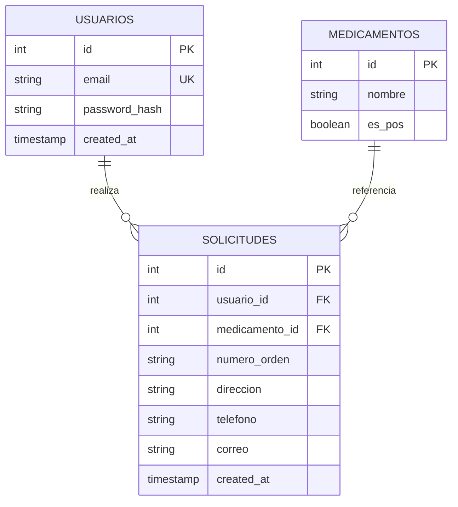

# EPS — Prueba técnica (Angular + Flask + PostgreSQL)

Aplicación **full stack** para **solicitudes de medicamentos**: autenticación (JWT), catálogo de medicamentos (POS / NO POS), creación de solicitudes con validación condicional y listado paginado.

Este repositorio contiene **dos proyectos independientes**:

| Carpeta | Rol |
|---------|-----|
| **`eps-solicitudes-api/`** | API REST Flask (módulos `auth` y solicitudes). |
| **`eps-solicitudes-web/`** | SPA Angular (login, registro, formulario, listado). |

La base de datos es **PostgreSQL**, dockerizada junto a la API en el `docker-compose` de la raíz.

---

## Repositorio

**GitHub:** [https://github.com/lordmkichavi-andes/nueva-eps-pt](https://github.com/lordmkichavi-andes/nueva-eps-pt)

Rama principal: **`main`**. En cada `push` se ejecuta **CI** (pytest + build de Angular): [`.github/workflows/ci.yml`](.github/workflows/ci.yml).

---

## Qué incluye esta entrega (checklist)

- [x] **Backend** Python (Flask): `/auth/login`, `/auth/register`, contraseñas con hash (bcrypt), JWT en rutas protegidas.
- [x] **Módulos separados** de autenticación y de solicitudes (blueprints).
- [x] **Frontend** Angular: login/registro, solicitud con campos extra si el medicamento es **NO POS**, listado **paginado** solo autenticado.
- [x] **PostgreSQL**: script [`schema.sql`](schema.sql) + modelo ER en este README.
- [x] **Documentación**: instalación, endpoints, entorno; Docker Compose para levantar API + BD.
- [x] **Pruebas** (refuerzo): pytest en API, tests unitarios básicos en Angular; CI en GitHub.

---

## Validación rápida (~5 minutos)

Objetivo: que una persona pueda **comprobar que todo funciona** sin adivinar comandos.

### Paso 0 — Requisitos

- **Docker Desktop** (o Docker Engine + Compose) funcionando.
- **Node.js 20+** y **npm** (solo para el front).

### Paso 1 — Levantar API y base de datos

En la **raíz del repositorio** (donde está `docker-compose.yml`):

```bash
docker compose up -d --build
```

Espera unos segundos y comprueba la API:

```bash
curl -s http://localhost:5000/health
```

**Resultado esperado:** `{"status":"ok"}`

Si falla el puerto **5432** en el host, este proyecto publica PostgreSQL en **5433** (ver tabla más abajo). La API sigue usando el servicio `db` por red interna.

### Paso 2 — Levantar el front

En **otra terminal**:

```bash
cd eps-solicitudes-web
npm install
npm start
```

**Resultado esperado:** compilación sin errores y mensaje indicando **`http://127.0.0.1:4200`** (o `localhost:4200`).

### Paso 3 — Probar en el navegador

1. Abre **http://localhost:4200**
2. **Registrarse** con un correo válido y contraseña de **al menos 8 caracteres** (no hay usuario por defecto).
3. En **Nueva solicitud**, elige un medicamento **POS** y envía; debe aparecer en **Mis solicitudes**.
4. Elige un medicamento **NO POS**: deben mostrarse y validarse orden, dirección, teléfono y correo.
5. Comprueba la **paginación** si hay más solicitudes que el tamaño de página.

### Paso 4 — (Opcional) Pruebas automáticas locales

```bash
# API — usar siempre el venv del proyecto
cd eps-solicitudes-api
python3 -m venv .venv
source .venv/bin/activate
python -m pip install -r requirements-dev.txt
python -m pytest -v
```

```bash
# Front — desde su carpeta
cd eps-solicitudes-web
npx ng test --no-watch --browsers=ChromeHeadless
npm run build
```

---

## Tabla de URLs y puertos

| Servicio | URL / puerto | Notas |
|----------|----------------|-------|
| **API (Flask)** | `http://localhost:5000` | Health: `GET /health` |
| **Front (Angular dev)** | `http://localhost:4200` | Configurado en `environment.ts` → `apiUrl` apunta a `:5000` |
| **PostgreSQL (host)** | `localhost:5433` | Usuario `eps_user`, BD `eps_db`, pass en README más abajo |
| **PostgreSQL (contenedor)** | servicio `db`, puerto interno 5432 | La API usa `db:5432` por Docker network |

El front envía el JWT en el header `Authorization: Bearer <token>` (interceptor Angular).

---

## Flujo de demostración sugerido (para video o revisión oral)

1. Mostrar `README` y estructura (`eps-solicitudes-api`, `eps-solicitudes-web`, `schema.sql`, `docker-compose.yml`).
2. `docker compose up -d --build` + `curl /health`.
3. Registro → login automático → pantalla de solicitudes.
4. Solicitud **POS** (solo medicamento).
5. Solicitud **NO POS** con datos extra.
6. Listado con paginación y cierre de sesión.

---

## Guía para quien revisa la entrega

| Criterio | Dónde verlo |
|----------|-------------|
| Separación auth / solicitudes | `eps-solicitudes-api/app/auth/`, `app/solicitudes/` |
| Contraseña no en texto plano | bcrypt en `app/auth/routes.py` |
| Endpoints requeridos | Tabla “Endpoints” más abajo |
| Script SQL + ER | `schema.sql` + diagrama Mermaid en este archivo |
| Validaciones | Backend: rutas + `validators.py`; Front: `shared/form-validators.ts` |
| Paginación | `GET /api/solicitudes?page=&per_page=` y pantalla “Mis solicitudes” |

---

## Requisitos (desarrollo local completo)

- Docker y Docker Compose
- Python 3.10+
- Node.js 20+ y npm

---

## 1. API + base de datos con Docker (recomendado para pruebas)

Desde la raíz del repo (levanta PostgreSQL **y** la API en **http://localhost:5000**):

```bash
docker compose up -d --build
```

Comprueba el estado:

```bash
curl -s http://localhost:5000/health
```

Deberías ver `{"status":"ok"}`. Los logs de la API: `docker compose logs -f api`.

Para parar: `docker compose down`. Si necesitas recrear la BD desde cero: `docker compose down -v` y vuelve a ejecutar el comando de arriba.

PostgreSQL queda expuesto en el host en **5433** → contenedor **5432** (así no choca con un PostgreSQL local que ya use **5432**). Para DBeaver: `localhost:5433`, usuario `eps_user`, BD `eps_db`. El script `schema.sql` se aplica en el **primer** arranque del volumen.

El backend usa el driver **psycopg 3** (`postgresql+psycopg://` en `DATABASE_URL`).

Credenciales por defecto (coinciden con `eps-solicitudes-api/.env.example`):

| Variable   | Valor      |
|-----------|------------|
| Usuario   | `eps_user` |
| Contraseña| `eps_pass` |
| Base      | `eps_db`   |

> Si el volumen ya existía de un intento anterior sin datos, elimínalo: `docker compose down -v` y vuelve a subir el servicio.

---

## 2. API en local sin Docker (solo desarrollo)

Si prefieres ejecutar Flask en tu máquina (necesitas PostgreSQL arriba, p. ej. solo `docker compose up -d db`):

```bash
cd eps-solicitudes-api
python3 -m venv .venv
source .venv/bin/activate   # Windows: .venv\Scripts\activate
pip install -r requirements.txt
cp .env.example .env
python wsgi.py
```

API en **http://localhost:5000** (modo desarrollo con recarga). Ajusta `DATABASE_URL` en `.env` si Postgres del compose está en el puerto **5433** del host.

### Endpoints

| Método | Ruta | Autenticación | Descripción |
|--------|------|---------------|-------------|
| `GET` | `/health` | No | Estado del servicio |
| `POST` | `/auth/register` | No | Registro (`email`, `password`) |
| `POST` | `/auth/login` | No | Login (`email`, `password`) → JWT |
| `GET` | `/api/medicamentos` | Bearer JWT | Listado de medicamentos |
| `POST` | `/api/solicitudes` | Bearer JWT | Crear solicitud (`medicamento_id` + campos extra si NO POS) |
| `GET` | `/api/solicitudes` | Bearer JWT | Listado paginado (`page`, `per_page`) del usuario |

**Headers:** `Authorization: Bearer <token>` en rutas protegidas.

**NO POS:** si el medicamento tiene `es_pos: false`, el cuerpo debe incluir `numero_orden`, `direccion`, `telefono`, `correo` (validados en backend).

---

## 3. Web — `eps-solicitudes-web` (Angular)

```bash
cd eps-solicitudes-web
npm install
npm start
```

Aplicación en **http://localhost:4200**. El `apiUrl` por defecto apunta a `http://localhost:5000` (`src/environments/environment.ts`).

---

## Modelo entidad-relación



---

## Pruebas unitarias

**API (pytest):** usan SQLite en memoria; no requieren PostgreSQL ni Docker.

Usa siempre **el mismo intérprete** para instalar y ejecutar (mejor un **venv** del proyecto):

```bash
cd eps-solicitudes-api
python3 -m venv .venv
source .venv/bin/activate          # Windows: .venv\Scripts\activate
python -m pip install -r requirements-dev.txt
python -m pytest -v
```

Si ves `ModuleNotFoundError` (p. ej. `bcrypt`) al lanzar `pytest` sin el venv activado, es porque `pip` instaló en otro Python distinto al que ejecuta pytest. Solución: activa `.venv` o usa explícitamente `python -m pytest` tras `python -m pip install ...`.

**Web (Karma + Jasmine):** hay que ejecutarlo **desde la carpeta del front** (`eps-solicitudes-web`), no desde `eps-solicitudes-api` (si no, Angular dirá *outside a workspace*).

```bash
cd eps-solicitudes-web
npm test
# o en una sola pasada sin abrir el navegador:
npx ng test --no-watch --browsers=ChromeHeadless
```

El enunciado de la prueba no exige tests; sirven como refuerzo y documentación del comportamiento esperado.

### CI en GitHub

En cada `push` se ejecuta el workflow [`.github/workflows/ci.yml`](.github/workflows/ci.yml): **pytest** en la API y **`npm run build`** en el front.

### Makefile (opcional)

Desde la raíz del repo: `make up` (Docker), `make test-api`, `make build-web`. Ver [`Makefile`](Makefile).

---

## Patrones y clean code (API)

| Principio / patrón | Cómo se aplica aquí |
|--------------------|---------------------|
| **Separación de capas** | Blueprints `auth` vs `solicitudes`; rutas delgadas. |
| **DRY** | Validación de correo centralizada en `app/validators.py`; fechas JSON en `app/serialization.py`. |
| **SRP** | `error_handlers.py` solo manejo HTTP/JWT; rutas solo orquestan. |
| **App factory** | `create_app()` permite tests y configuración por entorno. |
| **Seguridad** | Contraseñas con bcrypt; JWT en rutas protegidas; `IntegrityError` en registro. |

**Front (Angular):** servicios inyectables (`AuthService`, `SolicitudService`), rutas con `canActivate`, interceptor HTTP para JWT y 401, validadores en `shared/form-validators.ts`.

---

## Estructura del repositorio

- `docker-compose.yml` — PostgreSQL + API
- `schema.sql` — DDL + datos iniciales de medicamentos
- `eps-solicitudes-api/` — Flask, blueprints `auth` y `api` (solicitudes)
- `eps-solicitudes-web/` — Angular 19 (rutas lazy, interceptor JWT)

---

## Entorno de ejecución

| Componente   | Versión orientativa |
|-------------|---------------------|
| PostgreSQL  | 16 (imagen Alpine)  |
| Python      | 3.10+               |
| Flask       | 3.x                 |
| Angular     | 19                  |

---

## Licencia / uso

Proyecto de prueba técnica.
