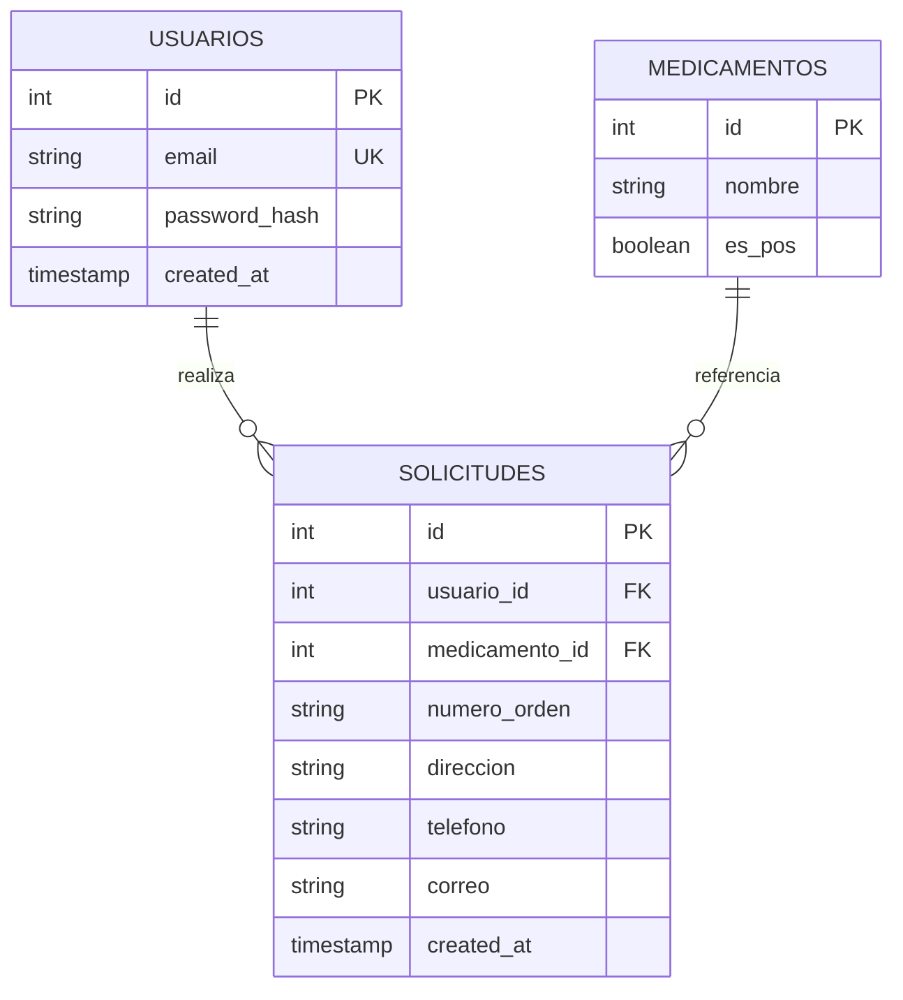

# EPS — Prueba técnica (Angular + Flask + PostgreSQL)

Dos proyectos independientes alineados con la prueba técnica (solicitudes de medicamentos EPS):

- **`eps-solicitudes-web/`** — aplicación Angular (login, registro, solicitudes, listado).
- **`eps-solicitudes-api/`** — API REST Flask (autenticación JWT y gestión de solicitudes).

La base de datos PostgreSQL se ejecuta con Docker.

## Requisitos

- Docker y Docker Compose
- Python 3.10+
- Node.js 20+ y npm

## 1. API + base de datos con Docker (recomendado para pruebas)

Desde la raíz del repo (levanta PostgreSQL **y** la API en **http://localhost:5000**):

```bash
docker compose up -d --build
```

Comprueba el estado:

```bash
curl -s http://localhost:5000/health
```

Deberías ver `{"status":"ok"}`. Los logs de la API: `docker compose logs -f api`.

Para parar: `docker compose down`. Si necesitas recrear la BD desde cero: `docker compose down -v` y vuelve a ejecutar el comando de arriba.

PostgreSQL queda expuesto en el host en **5433** → contenedor **5432** (así no choca con un PostgreSQL local que ya use **5432**). Para DBeaver: `localhost:5433`, usuario `eps_user`, BD `eps_db`. El script `schema.sql` se aplica en el **primer** arranque del volumen.

El backend usa el driver **psycopg 3** (`postgresql+psycopg://` en `DATABASE_URL`).

Credenciales por defecto (coinciden con `eps-solicitudes-api/.env.example`):

| Variable   | Valor      |
|-----------|------------|
| Usuario   | `eps_user` |
| Contraseña| `eps_pass` |
| Base      | `eps_db`   |

> Si el volumen ya existía de un intento anterior sin datos, elimínalo: `docker compose down -v` y vuelve a subir el servicio.

## 2. API en local sin Docker (solo desarrollo)

Si prefieres ejecutar Flask en tu máquina (necesitas PostgreSQL arriba, p. ej. solo `docker compose up -d db`):

```bash
cd eps-solicitudes-api
python3 -m venv .venv
source .venv/bin/activate   # Windows: .venv\Scripts\activate
pip install -r requirements.txt
cp .env.example .env
python wsgi.py
```

API en **http://localhost:5000** (modo desarrollo con recarga).

### Endpoints

| Método | Ruta | Autenticación | Descripción |
|--------|------|---------------|-------------|
| `GET` | `/health` | No | Estado del servicio |
| `POST` | `/auth/register` | No | Registro (`email`, `password`) |
| `POST` | `/auth/login` | No | Login (`email`, `password`) → JWT |
| `GET` | `/api/medicamentos` | Bearer JWT | Listado de medicamentos |
| `POST` | `/api/solicitudes` | Bearer JWT | Crear solicitud (`medicamento_id` + campos extra si NO POS) |
| `GET` | `/api/solicitudes` | Bearer JWT | Listado paginado (`page`, `per_page`) del usuario |

**Headers:** `Authorization: Bearer <token>` en rutas protegidas.

**NO POS:** si el medicamento tiene `es_pos: false`, el cuerpo debe incluir `numero_orden`, `direccion`, `telefono`, `correo` (validados en backend).

## 3. Web — `eps-solicitudes-web` (Angular)

```bash
cd eps-solicitudes-web
npm install
npm start
```

Aplicación en **http://localhost:4200**. El `apiUrl` por defecto apunta a `http://localhost:5000` (`src/environments/environment.ts`).

## Modelo entidad-relación



## Pruebas unitarias

**API (pytest):** usan SQLite en memoria; no requieren PostgreSQL ni Docker.

Usa siempre **el mismo intérprete** para instalar y ejecutar (mejor un **venv** del proyecto):

```bash
cd eps-solicitudes-api
python3 -m venv .venv
source .venv/bin/activate          # Windows: .venv\Scripts\activate
python -m pip install -r requirements-dev.txt
python -m pytest -v
```

Si ves `ModuleNotFoundError` (p. ej. `bcrypt`) al lanzar `pytest` sin el venv activado, es porque `pip` instaló en otro Python distinto al que ejecuta pytest. Solución: activa `.venv` o usa explícitamente `python -m pytest` tras `python -m pip install ...`.

**Web (Karma + Jasmine):** hay que ejecutarlo **desde la carpeta del front** (`eps-solicitudes-web`), no desde `eps-solicitudes-api` (si no, Angular dirá *outside a workspace*).

```bash
cd eps-solicitudes-web
npm test
# o en una sola pasada sin abrir el navegador:
npx ng test --no-watch --browsers=ChromeHeadless
```

El enunciado de la prueba no exige tests; sirven como refuerzo y documentación del comportamiento esperado.

### CI en GitHub (badge verde en el repo)

Si subes el código a GitHub, en cada `push` se ejecuta el workflow [`.github/workflows/ci.yml`](.github/workflows/ci.yml): **pytest** en la API y **`npm run build`** en el front. Refuerza la entrega sin coste para quien revisa.

### Makefile (opcional)

Desde la raíz del repo: `make up` (Docker), `make test-api`, `make build-web`. Ver [`Makefile`](Makefile).

## Patrones y clean code (API)

| Principio / patrón | Cómo se aplica aquí |
|--------------------|---------------------|
| **Separación de capas** | Blueprints `auth` vs `solicitudes`; rutas delgadas. |
| **DRY** | Validación de correo centralizada en `app/validators.py`; fechas JSON en `app/serialization.py`. |
| **SRP** | `error_handlers.py` solo manejo HTTP/JWT; rutas solo orquestan. |
| **App factory** | `create_app()` permite tests y configuración por entorno. |
| **Seguridad** | Contraseñas con bcrypt; JWT en rutas protegidas; `IntegrityError` en registro. |

**Front (Angular):** servicios inyectables (`AuthService`, `SolicitudService`), rutas con `canActivate`, interceptor HTTP para JWT y 401, componentes enfocados en UI.

## Estructura del repositorio

- `docker-compose.yml` — PostgreSQL 16
- `schema.sql` — DDL + datos iniciales de medicamentos
- `eps-solicitudes-api/` — Flask, blueprints `auth` y `api` (solicitudes)
- `eps-solicitudes-web/` — Angular 19 (rutas lazy, interceptor JWT)

## Entorno de ejecución

| Componente   | Versión orientativa |
|-------------|---------------------|
| PostgreSQL  | 16 (imagen Alpine)  |
| Python      | 3.10+               |
| Flask       | 3.x                 |
| Angular     | 19                  |

## Licencia / uso

Proyecto de prueba técnica.
